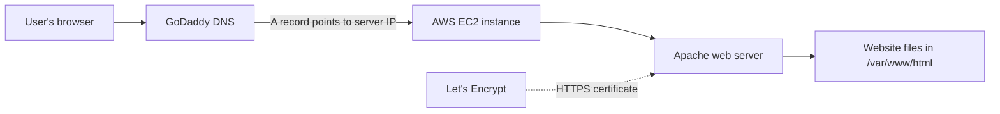

# Portfolio Website on AWS EC2

A personal portfolio website hosted on an AWS EC2 server with a custom domain and free HTTPS.

**Live site:** https://akashmade.in

## What this project does

- Runs a website on an **Ubuntu EC2 instance** using the **Apache** web server
- Uses a **custom domain** (`akashmade.in`) bought from GoDaddy
- Uses a **free HTTPS certificate** from Let's Encrypt (renews automatically)
- Can be updated with one command using a deploy script

## How it works (architecture)



In simple words:

1. A visitor types `akashmade.in` in the browser.
2. **GoDaddy DNS** tells the browser the IP address of my server.
3. The request reaches my **EC2 instance** on AWS.
4. **Apache** receives it and sends back the website files.
5. The connection is secured with an **HTTPS certificate** from Let's Encrypt.

## Tech stack

| Part | Tool |
|---|---|
| Cloud | AWS EC2 (Ubuntu) |
| Web server | Apache2 |
| Domain and DNS | GoDaddy |
| HTTPS | Certbot and Let's Encrypt |
| Firewall | AWS Security Group |
| Version control | Git and GitHub |

## Project structure

```
.
├── README.md
├── .gitignore
├── website/                  # website files (HTML, CSS, JS)
├── config/
│   ├── akashmade.conf        # Apache virtual host
│   └── security-group.md     # firewall rules and why
├── scripts/
│   └── deploy.sh             # copy files and reload Apache
└── docs/
    └── screenshots/          # proof the site is live
```

## Steps I followed

1. Launched an Ubuntu EC2 instance.
2. Opened ports 80 and 443 to everyone, and port 22 (SSH) for admin access only.
3. Installed Apache and placed the website files in `/var/www/html`.
4. Bought the domain `akashmade.in` from GoDaddy.
5. Added an **A record** in GoDaddy DNS pointing the domain to the server IP.
6. Created an Apache virtual host for the domain (`config/akashmade.conf`).
7. Installed a free HTTPS certificate with Certbot.
8. Tested automatic renewal with `sudo certbot renew --dry-run`.

## How to deploy updates

On the server, from the repository folder:

```bash
chmod +x scripts/deploy.sh
./scripts/deploy.sh
```

The script copies the files, fixes permissions, checks the Apache config and reloads Apache.

## Problems I faced and how I fixed them

| Problem | Fix |
|---|---|
| "Failed to connect to your instance" in EC2 Instance Connect | The SSH rule only allowed my IP, but the browser button connects from AWS servers. I changed the security group rule. |
| Site opened by IP but not by domain | DNS had not updated yet. I waited and checked with `nslookup`. |
| Certbot rejected my email | I entered `yes` instead of an email address. I re-entered a valid email. |

## Cost

- Domain: paid once per year at the registrar
- EC2, storage and public IPv4: covered by AWS credits
- HTTPS certificate: free

## What I learned

- How DNS connects a domain to a server
- How Apache virtual hosts work
- How security groups control access
- How HTTPS certificates are issued and renewed

## Future improvements

- Auto-deploy with GitHub Actions
- Build the server with Terraform
- Add CloudFront and monitoring
